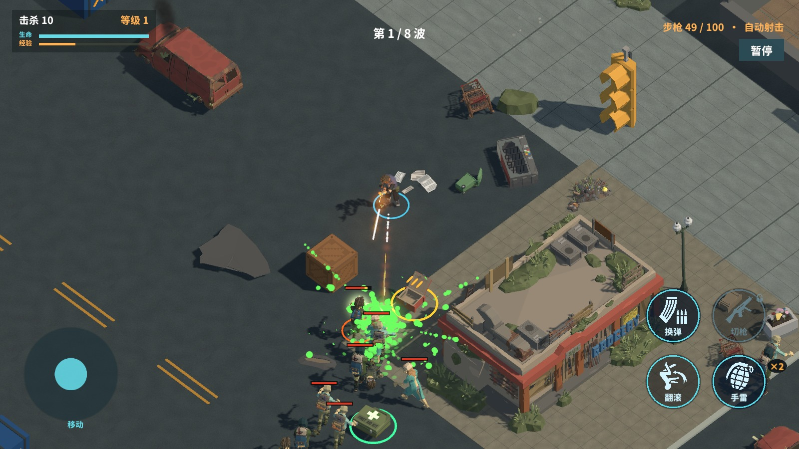
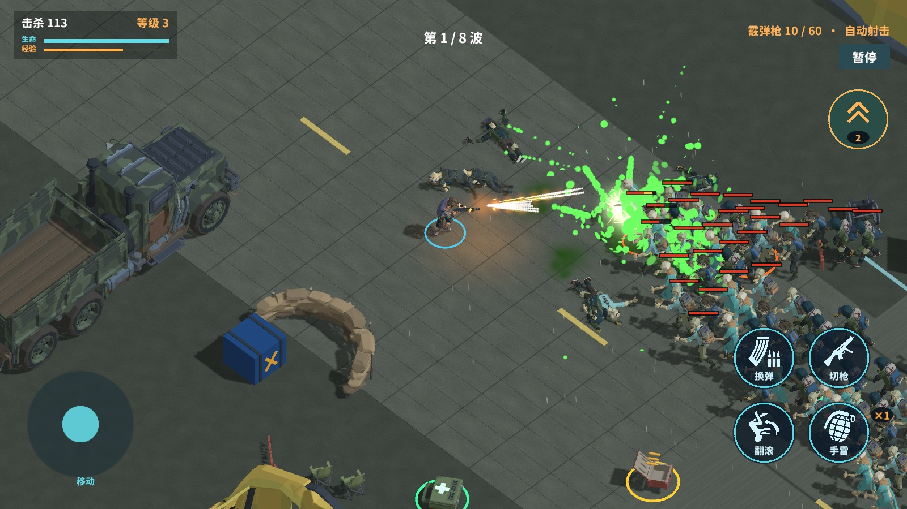
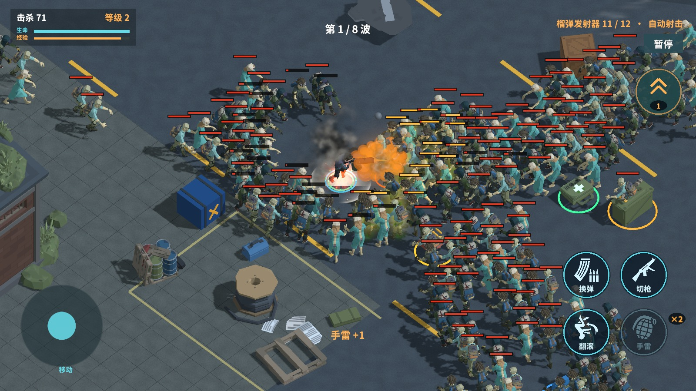
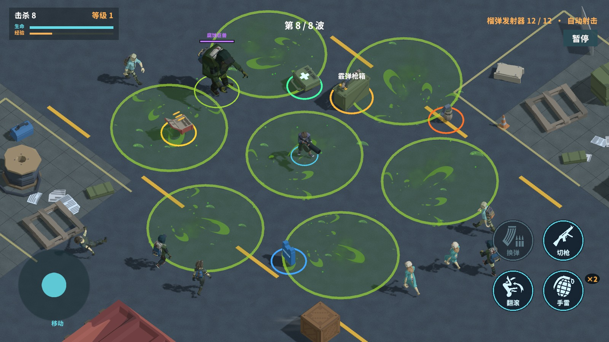
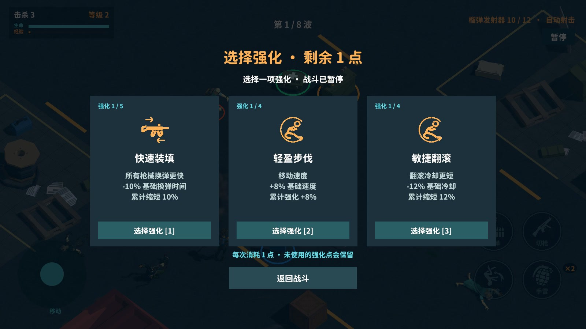
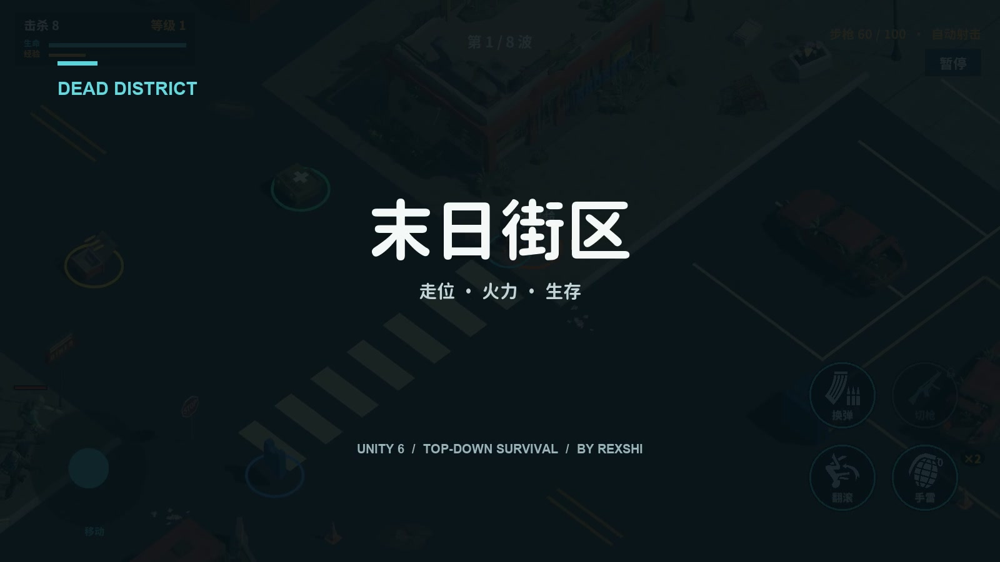

<div align="center">

# 末日街区 · Dead District

**穿过废弃街区，在尸潮中找到下一条生路。**

一款为手机横屏操作设计的 3D 俯视角僵尸生存射击游戏。
自动瞄准与射击，让注意力留给走位、武器选择和突围时机。

[English](README.en.md) · [观看介绍视频](https://github.com/shishirui/zombie-survival-open-source/releases/download/v0.13.0-source/dead-district-trailer.mp4) · [开发指南](docs/DEVELOPMENT.md) · [素材与许可](THIRD_PARTY.md)


**Unity 6.3 · URP · C# · iOS · 自有代码 MIT**

</div>

> **这是游戏的自有代码开源版，基于 0.13.0 / Build 64。** 包含玩法、UI、关卡配置、编辑器工具及验证脚本；不包含商业引擎源码、购买的美术/音频素材、场景成品或由这些素材派生的资源。克隆仓库后不能直接点击 Play 得到截图中的完整游戏，详见[开发指南](docs/DEVELOPMENT.md)。

## 游戏里有什么

- **三张独立地图**：商业街、隔离营地、货运站，各有八波战斗和不同的 Boss。
- **逐关扩展的武器选择**：步枪负责持续火力，霰弹枪近距离散射，榴弹发射器以直线弹道和范围爆炸应对密集敌群。
- **有呼吸感的波次**：清空当前波后休整 5 秒，再进入下一波；后两关通过多方向增援与更高的在场数量增加压力。
- **主动强化**：击杀积攒强化点，准备好时再打开三选一面板。获得经验不会突然打断一次投掷或射击。
- **看得清的威胁**：普通感染者、快速感染犬、重装感染者，以及砸地、冲撞、酸液区域攻击。
- **移动端操作**：移动摇杆、拖动瞄准手雷、翻滚、主动换弹、切枪；可调摇杆方式、按钮大小、音乐、音效、镜头震动与闪光减弱。
- **场景与反馈**：可破坏物、门、遮挡淡化、尸体退场、补给拾取、环境氛围和分层战斗特效。

## 从街区到货运站

| 关卡 | 战斗空间 | 可获得的枪械 | Boss |
| --- | --- | --- | --- |
| 01 · 废弃商业街 | 开阔街道与建筑间隙，熟悉走位和生存 | 步枪 | 街区暴君：范围砸地 |
| 02 · 废弃隔离营地 | 帐篷、卡车和掩体之间的绕行 | 步枪、霰弹枪 | 冲撞；半血后可连续冲撞，撞墙留下反击机会 |
| 03 · 废弃货运站 | 货运设施与多方向尸群 | 步枪、霰弹枪、榴弹发射器 | 多点酸液投射与地面区域封锁 |

枪械范围按当前关卡限制；新增武器仍需要在局内获取。通关后解锁下一关，关卡记录保存在本地。

| 商业街 · 持续火力 | 隔离营地 · 近身突围 |
| :---: | :---: |
|  |  |
| **货运站 · 范围爆破** | **Boss · 酸液封锁** |
|  |  |



## 介绍视频

[](https://github.com/shishirui/zombie-survival-open-source/releases/download/v0.13.0-source/dead-district-trailer.mp4)

视频和截图取自本项目的桌面演示构建，使用与手机版共用的玩法与美术。拍摄使用了脚本控制、预设武器/Boss 和角色保护，以便展示机制；不是手机实测帧率或自然通关录像。视频包含实际游戏音效；媒体中的第三方素材不随代码改授 MIT。

## 阅读代码

| 想了解的系统 | 从这里开始 |
| --- | --- |
| 主循环、可见目标选择、连贯射击 | [SurvivalGame.cs](Assets/ZombieSurvival/Runtime/SurvivalGame.cs) |
| 武器状态、弹匣、换弹与切换 | [SurvivalWeapons.cs](Assets/ZombieSurvival/Runtime/SurvivalWeapons.cs) |
| 直线榴弹、烟雾尾迹与爆炸 | [LauncherProjectiles.cs](Assets/ZombieSurvival/Runtime/LauncherProjectiles.cs) |
| 波次队列、在场上限、多方向增援 | [ChapterDirector.cs](Assets/ZombieSurvival/Runtime/ChapterDirector.cs) |
| 三选一强化与战斗衔接 | [RunGrowth.cs](Assets/ZombieSurvival/Runtime/RunGrowth.cs) |
| 冲撞、酸液和预警 | [EliteCharge.cs](Assets/ZombieSurvival/Runtime/EliteCharge.cs)、[EliteAcid.cs](Assets/ZombieSurvival/Runtime/EliteAcid.cs) |
| 触摸输入与手机菜单 | [SurvivalInput.cs](Assets/ZombieSurvival/Runtime/SurvivalInput.cs)、[MobileShellHud.cs](Assets/ZombieSurvival/Runtime/MobileShellHud.cs) |
| 遮挡透明与首次渲染准备 | [StreetOcclusion.cs](Assets/ZombieSurvival/Runtime/StreetOcclusion.cs)、[OcclusionPreparation.cs](Assets/ZombieSurvival/Runtime/OcclusionPreparation.cs) |
| 地图生成与美术接入 | [Editor](Assets/ZombieSurvival/Editor) |

```text
Assets/ZombieSurvival/
├── Runtime/        游戏逻辑、UI、效果调度与运行时验证
├── Editor/         场景生成、美术接入、构建与编辑器检查
├── Resources/      自有的三关数值与波次配置
├── Settings/       自有的基础战斗参数
└── Plugins/iOS/    iOS 启动参数桥接
Packages/           Unity 包版本清单
ProjectSettings/    编辑器版本、层与基础物理配置
```

## 开发与运行

基线为 **Unity 6000.3.25f1、URP 17.3.0、TopDown Engine 4.2**。iOS 构建另外需要 Xcode 和开发者自己的签名配置。

1. 克隆仓库，先阅读[素材边界](THIRD_PARTY.md)。仅阅读 C# 代码无需购买素材。
2. 在隔离的 Unity 工程中导入自行取得授权的 TopDown Engine，再接入这里的代码。`SurvivalHealth` 继承了该引擎的 `Health`。
3. 复现完整表现还需要美术、音频、字体、图标，以及相应的 `PackVisuals` 资源、场景与导航网格。原始素材包不能代替项目内的全部配置。
4. 按[开发指南](docs/DEVELOPMENT.md)接入或替换素材、配置三个场景，并在编辑器中验证后构建。

**当前没有一键恢复完整美术工程的脚本，也没有声称仅导入付费包即可复现全部截图。** 历史编辑器工具保留下来用于理解搭建过程；运行会改写场景与资源，应在工程副本里使用。

## 操作

| 动作 | 手机 | 桌面调试 |
| --- | --- | --- |
| 移动 | 左侧摇杆 | WASD / 方向键 |
| 射击 | 对可见目标自动瞄准、射击 | 同左 |
| 手雷 | 右侧手雷按钮拖动瞄准 | G 快速投掷 |
| 翻滚 / 换弹 / 切枪 | 右侧对应图标 | Shift / R / Q |
| 强化 | 点击右上方强化点图标 | 点击图标，数字 1–3 选择 |
| 暂停 | 暂停按钮 | Esc |

## 参与开发

欢迎提交 Bug、玩法建议和代码改进。反馈请附关卡、复现步骤、设备和版本；性能问题尽量附录屏。请先阅读 [CONTRIBUTING.md](CONTRIBUTING.md)，不要在 Issue、PR 或提交历史中上传商业素材、签名文件或账号凭据。

可以继续改进的方向：素材无关的示例场景、完整接入工具、更多武器/敌人组合、手机性能分析与更广泛的机型测试。它们是后续方向，不是当前已交付功能。

## 许可与致谢

Copyright © 2026 **Rexshi**。仓库中的自有代码和自有配置使用 [MIT License](LICENSE)。

完整游戏使用 More Mountains、Synty Studios、Archanor VFX 等作者的商业资源，以及 Game-icons.net 图标、Quaternius 模型和开放字体。它们各自的权利与署名见 [THIRD_PARTY.md](THIRD_PARTY.md)；截图、视频和游戏名称不因本仓库的 MIT 许可证而成为可提取再分发的素材库。
